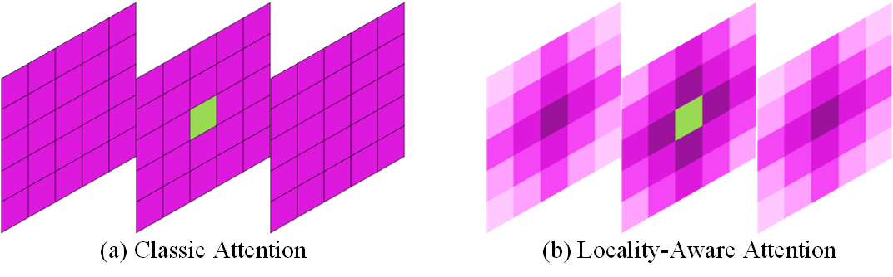

<div align="center">
<h1>LACC-SLR </h1>
<h3>LACC-SLR: Local Attention and Contrastive Clustering Network for Sign Language Recognition</h3>

[Tangfei Tao]<sup>1</sup>,[Xiao Che](https://github.com/Shuanglin-1126)<sup>2</sup>,[Yizhe Zhao]<sup>3</sup>,[Zhihao Yang]<sup>4</sup>

Xi'an Jiaotong University.


</div>


## :white_check_mark: Updates
* **`July. 19th, 2025`**: Update:  we clean the code and update it.

## Abstract

We propose a novel framework, Local Attention and Contrastive Clustering Network for Sign Language Recognition (LACC-SLR), to enhance both global and fine-grained feature extraction in sign language videos. Our approach leverages dual-modal inputs—RGB video and human skeleton data—and adopts a Parallel Visual-Skeleton Framework (PVSF) for cross-modal fusion. The backbone network, Locality-Aware Attention MViT (LAA-MViT), introduces  a 3D Manhattan distance-based decay mechanism into the attention computation, encouraging the model to focus on spatially and temporally proximate regions while preserving global context. Furthermore, we present the Contrastive Label-Center Clustering (CLCC) module, which improves feature compactness and inter-class separability by aligning sample features to learnable class-wise center vectors, and performing label smoothing based on inter-class similarity. Extensive experiments on benchmark datasets—WLASL, NMFs-CSL, AUTSL, and SLR500—demonstrate that our method outperforms existing state-of-the-art techniques, achieving superior recognition accuracy and generalization capability across diverse sign language scenarios. This code will be released to the public. 

## Overview

* [**LACC-SLR**] serves as a noval method for sign language recognition.

<p align="center">
  
</p>

* **LA-attention emphasize local features while preserving global context**

<p align="center">
  
</p>

* **CLCC enhances inter-class separability while reducing intra-class variability**

<p align="center">
  
</p>

* **PVSF utilizes both RGB videos and human skeleton sequences as input**
<p align="center">
  
</p>


## Getting Started

### Installation

**Step 1: Environment Setup:**

```bash
conda create -n LACC_SLR
conda activate LACC_SLR
```

**Step 2: Install Dependencies:**
```bash
git clone https://github.com/Shuanglin-1126/LACC-SLR.git
cd LACC-SLR
pip install requirements.txt
```

LACC-SLR recommends setting up a conda environment and installing dependencies via pip. Use the following commands to set up your environment:
Also, We recommend using the pytorch>=2.0, cuda>=11.8. But lower version of pytorch and CUDA are also supported.

### Model Training and Inference

Data preparation: Dataset with the following folder structure.

```
│Dataset/
├──videos
│  ├──train/
│  │   ├── 000011
│  │   │   ├── 00001.JPG
│  │   │   ├── 00002.JPG
│  │   │   ├── ......
│  │   ├── ......
│  ├──test/
│  │   ├── 000045
│  │   │   ├── 00001.JPG
│  │   │   ├── 00002.JPG
│  │   │   ├── ......
│  │   ├── ......
├──keypoints
│  ├── 000011.npy
│  ├── 000045.npy
│  ├── ......
```

**Train:**
```bash
python train.py
```

**Inference:**
```bash
python prediction.py
```

## Citation

```
```

## Acknowledgment

This project is based on MViTv2 ([paper](https://arxiv.org/abs/2112.01526), [code](https://github.com/facebookresearch/mvit)), [action-recognition-pytorch](https://arxiv.org/abs/2112.01526).

